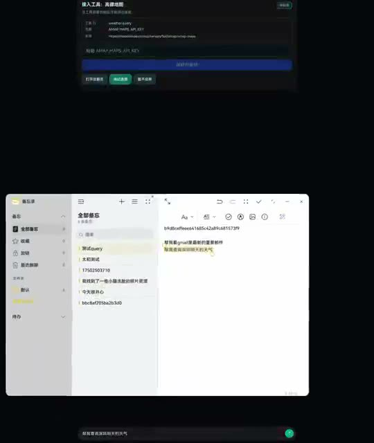
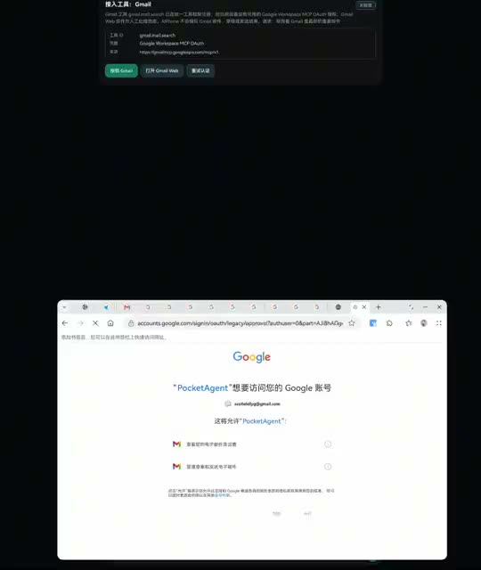

# HarmonyAgentPhone

> 用一句话把手机变成任务卡片。HarmonyOS 原生 A2UI、设备本地工具、真实数据边界。

HarmonyAgentPhone 是一个可发布的 HarmonyOS agent phone demo：用户用自然语言提出请求，模型生成原生 A2UI 任务卡片，工具层再调用真实的查询型 provider。它不会用假航班、假餐厅、假邮件或假社交消息把 demo 演圆。


## ✨ Highlights

- 🧠 **一句话生成原生卡片**：模型输出 A2UI JSONL，ArkUI 渲染成任务界面。
- 📍 **真实查询，不造数据**：出行、餐饮、Gmail、动态工具都走注册工具或显示真实失败。
- 📱 **设备优先**：默认运行在 HarmonyOS 设备侧，模型地址默认 `http://127.0.0.1:11434`。
- 🔌 **动态工具接入**：通过 `local://aiphone-tools` 和声明式工具目录接入能力。
- 🧪 **可验证**：核心 parser、renderer、tool routing、provider mapping 都有测试覆盖。

## 🎬 Demo

点击缩略图查看压缩版录屏。

| 出行卡片 | 餐饮卡片 | 动态天气工具 |
| --- | --- | --- |
| [](docs/assets/demos/travel-card.mp4) | [](docs/assets/demos/food-card.mp4) | [](docs/assets/demos/weather-dynamic-mcp.mp4) |

| Gmail 查询 | Gmail 草稿 |
| --- | --- |
| [](docs/assets/demos/gmail-search.mp4) | [](docs/assets/demos/gmail-draft.mp4) |

## 🚀 3 Steps

1. 用 DevEco Studio 打开仓库，运行 `entry` 模块。
2. 在设置页测试模型连接。默认本地模型地址是 `http://127.0.0.1:11434`，模型名是 `Qwen3-8B`。
3. 输入一句话，例如：

```text
我明天从北京去上海，帮我搜索出行方案
帮我搜索深圳坂田华为基地附近的咖啡
帮我查看 Gmail 最近邮件
```

完整教程见 [docs/quickstart.md](docs/quickstart.md)。

## 🔐 Truthfulness Boundary

HarmonyAgentPhone 默认走设备本地 `local://aiphone-tools`。没有模型、provider key、OAuth、系统权限或真实执行器时，界面会显示缺失配置或授权状态，不会伪造结果。

当前边界：

- ✅ 查询火车、航班、餐饮、Gmail、动态工具结果
- ✅ 展示真实 provider 返回、空结果、错误和缺失配置
- ✅ 将可用结果固定成 HarmonyOS 桌面导航卡片
- ❌ 不订票、不支付、不抢票
- ❌ 不下单、不建购物车、不自动领券
- ❌ 不伪造 Gmail 邮件、草稿、发送状态
- ❌ 不伪造微信消息或社交联系人

## 🧩 Project Map

- `entry/`：HarmonyOS ArkTS app、A2UI renderer、模型客户端、设备侧工具适配器。
- `tool-gateway/`：可选 Node.js 兼容网关和 smoke harness，不是默认运行必需服务。
- `scripts/sync-provider-config.mjs`：把本地 provider key 写入忽略的 HAP rawfile。
- `scripts/aiphone-device-smoke.mjs`：HDC 设备 smoke 检查。
- `docs/quickstart.md`：完整上手教程。
- `docs/a2ui.md`：A2UI 协议说明。

## 🛠 Provider Keys

需要真实 provider 查询时：

```bash
cd tool-gateway
cp .env.example .env.local
```

填入需要启用的 key，然后同步到本地 HAP rawfile：

```bash
cd ..
node scripts/sync-provider-config.mjs
```

生成文件 `entry/src/main/resources/rawfile/aiphone_provider_config.json` 已被 git 忽略，不要提交。

## ✅ Test

```bash
cd tool-gateway
npm run smoke
```

设备已连接且应用已安装时：

```bash
node scripts/aiphone-device-smoke.mjs
```

ArkTS 单元测试请在 DevEco Studio 中运行 `entry/src/test`。

## License

No open-source license has been selected yet. All rights are reserved unless a license is added later.
