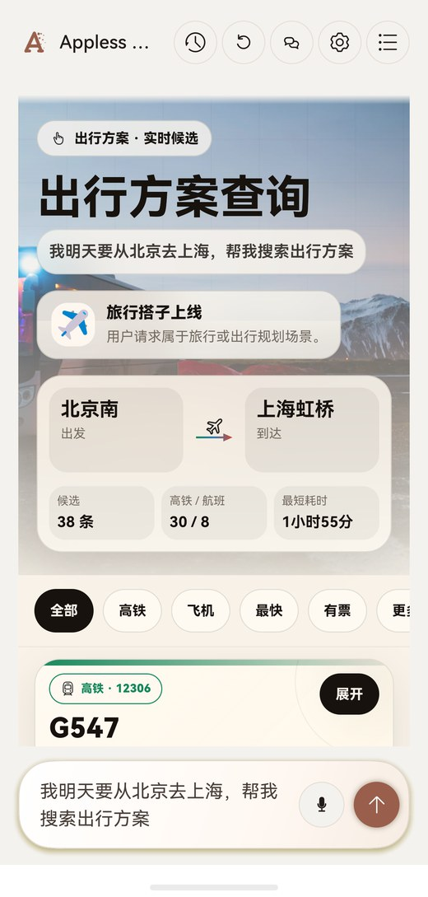
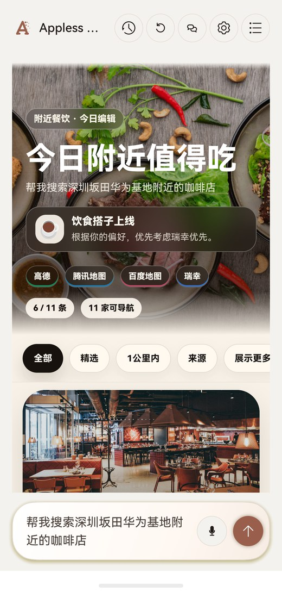
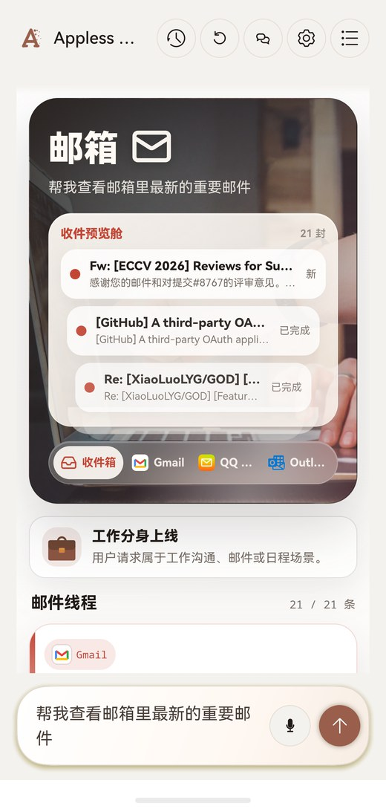
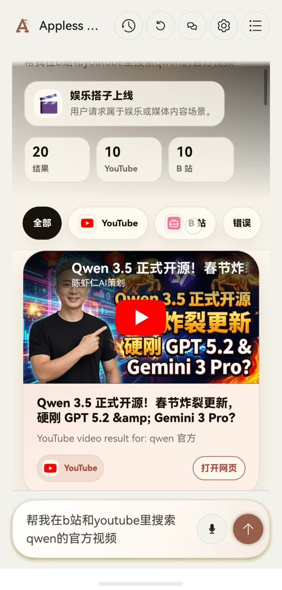
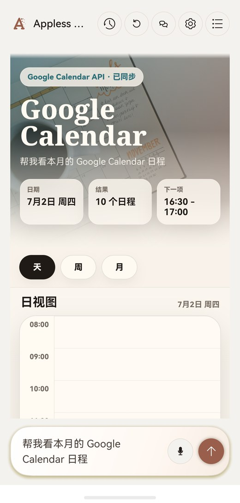
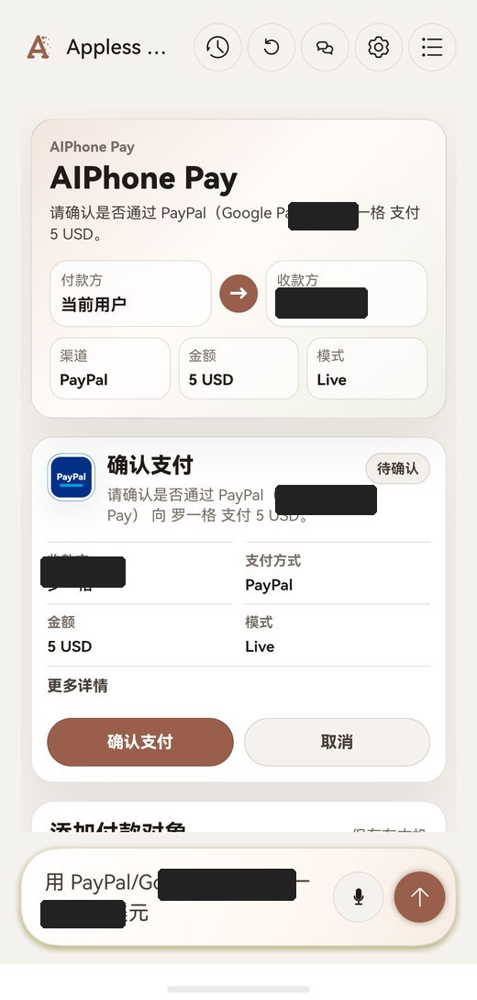
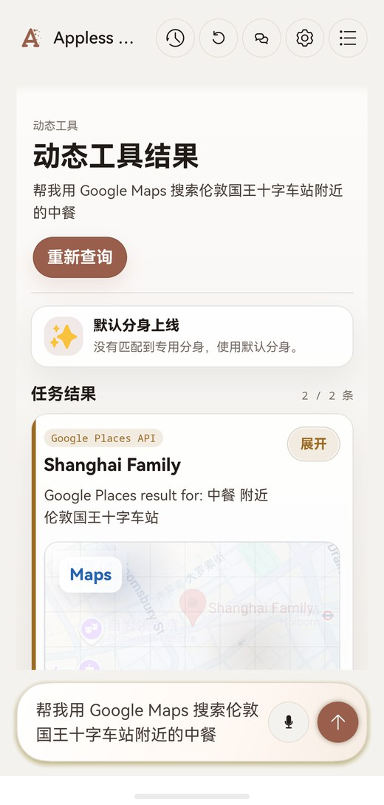
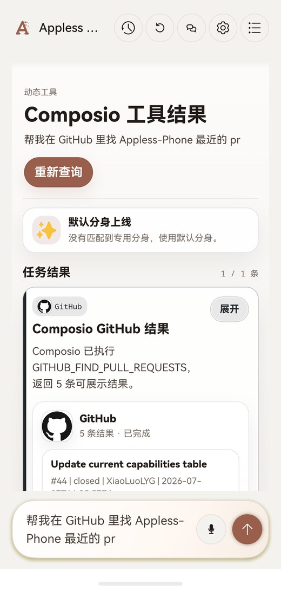
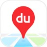

  

<h1 align="center">Appless Phone</h1>

  <strong>Mobile Codex for the apps you no longer have to open.</strong>

  Tell Appless Phone what you want. It builds a task-specific mobile interface in real time, pulls the work across the apps behind it, and finishes multi-app jobs in one place instead of making you switch screens. Each request gets the interface it needs, not the interface a single app shipped with.

  <a href="#-what-it-does">What it does</a> ·
  <a href="#-product-snapshots">Snapshots</a> ·
  <a href="#-connected-apps">Connected apps</a> ·
  <a href="#-demo-gallery">Demos</a> ·
  <a href="#-run-locally">Run locally</a>

## ✨ What it does

Appless Phone is built around the AI phone idea: the agent is the entry point, and apps become tools behind the task.

Ordering coffee, checking mail, planning a trip, searching videos, updating a calendar, or looking through SaaS tools should not mean jumping across a dozen apps. Appless Phone gives those jobs one mobile surface. It gathers real provider results, shows the source, and lets you review the final action.

Current capabilities include:

- Travel search across high-speed rail and flights.
- Nearby food and place search, with Google Maps when explicitly requested.
- Gmail, QQ Mail, and Outlook inbox aggregation, thread views, and draft creation.
- Google Calendar search and event creation with confirmation.
- YouTube and Bilibili video search in one media view.
- PayPal, Stripe, and Google Pay payment flows with review-first handoff.
- SocialHub reading across X, Slack, WeCom, and connected social apps.
- Composio-backed search for GitHub, Google Drive, Google Docs, Notion, Linear, Asana, Trello, HubSpot, Salesforce, and more.
- Personal memory updates, such as local preferences for coffee, food, or routine choices.

## 📱 Product snapshots

<table>
  <tr>
    <td align="center" width="25%"> Travel planning</td>
    <td align="center" width="25%"> Local food search</td>
    <td align="center" width="25%"> Mail aggregation</td>
    <td align="center" width="25%"> Media search</td>
  </tr>
</table>

<table>
  <tr>
    <td align="center" width="25%"> Calendar</td>
    <td align="center" width="25%"> Payments</td>
    <td align="center" width="25%"> Maps</td>
    <td align="center" width="25%"> Composio tools</td>
  </tr>
</table>

## 🔌 Connected apps

The app surface is designed around real providers and recognizable app entry points. The full capability table lives in [docs/current-capabilities.md](docs/current-capabilities.md).

<table>
  <tr>
    <td align="center"> Gmail</td>
    <td align="center"> QQ Mail</td>
    <td align="center"> Outlook</td>
    <td align="center"> Calendar</td>
    <td align="center"> Maps</td>
    <td align="center"> YouTube</td>
    <td align="center"> Bilibili</td>
  </tr>
  <tr>
    <td align="center"> GitHub</td>
    <td align="center"> Drive</td>
    <td align="center"> Docs</td>
    <td align="center"> Slack</td>
    <td align="center"> WeCom</td>
    <td align="center"> X</td>
    <td align="center"> Notion</td>
  </tr>
  <tr>
    <td align="center"> Linear</td>
    <td align="center"> Asana</td>
    <td align="center"> Trello</td>
    <td align="center"> HubSpot</td>
    <td align="center"> Salesforce</td>
    <td align="center"> Discord</td>
    <td align="center"> LinkedIn</td>
  </tr>
  <tr>
    <td align="center"> WhatsApp</td>
    <td align="center"> Instagram</td>
    <td align="center"> Spotify</td>
    <td align="center"> TikTok</td>
    <td align="center"> Ticketmaster</td>
    <td align="center"> PayPal</td>
    <td align="center"> Stripe</td>
  </tr>
  <tr>
    <td align="center"> Google Pay</td>
    <td align="center"> Amap</td>
    <td align="center"> Baidu Maps</td>
    <td align="center"> Tencent Maps</td>
    <td align="center"> Meituan</td>
    <td align="center"> Taobao</td>
    <td align="center"> Luckin</td>
  </tr>
  <tr>
    <td align="center"> McDonald's</td>
    <td align="center"> KFC</td>
  </tr>
</table>

## 🎬 Demo gallery

Videos are embedded as muted autoplay loops with controls. The Chinese text is the exact query used in the demo, followed by a short English translation.

### Travel and local life

<table>
  <tr>
    <td align="center" width="33%"><video src="docs/assets/demos/latest/travel-beijing-shanghai.mp4" poster="docs/assets/demos/posters/travel-beijing-shanghai.jpg" autoplay muted loop playsinline controls width="100%" aria-label="Travel demo"></video> <code>我明天要从北京去上海，帮我搜索合适的出行方式</code> Find suitable travel options from Beijing to Shanghai tomorrow</td>
    <td align="center" width="33%"><video src="docs/assets/demos/latest/food-coffee-huawei.mp4" poster="docs/assets/demos/posters/food-coffee-huawei.jpg" autoplay muted loop playsinline controls width="100%" aria-label="Coffee search demo"></video> <code>帮我查深圳坂田华为基地附近的咖啡店</code> Find coffee near Huawei Base in Bantian, Shenzhen</td>
    <td align="center" width="33%"><video src="docs/assets/demos/latest/google-maps-kings-cross.mp4" poster="docs/assets/demos/posters/google-maps-kings-cross.jpg" autoplay muted loop playsinline controls width="100%" aria-label="Google Maps demo"></video> <code>帮我用 Google Maps 搜索伦敦国王十字车站附近的中餐</code> Search Google Maps for Chinese food near King's Cross</td>
  </tr>
</table>

### Mail and calendar

<table>
  <tr>
    <td align="center" width="25%"><video src="docs/assets/demos/latest/mail-important-aggregate.mp4" poster="docs/assets/demos/posters/mail-important-aggregate.jpg" autoplay muted loop playsinline controls width="100%" aria-label="Mail aggregation demo"></video> <code>帮我查看邮箱里最新的重要邮件</code> Show the latest important emails across my inboxes</td>
    <td align="center" width="25%"><video src="docs/assets/demos/latest/gmail-eccv-paper.mp4" poster="docs/assets/demos/posters/gmail-eccv-paper.jpg" autoplay muted loop playsinline controls width="100%" aria-label="Gmail ECCV demo"></video> <code>帮我查看我Gmail里和我eccv论文相关的邮件</code> Find Gmail messages related to my ECCV paper</td>
    <td align="center" width="25%"><video src="docs/assets/demos/latest/gmail-web.mp4" poster="docs/assets/demos/posters/gmail-web.jpg" autoplay muted loop playsinline controls width="100%" aria-label="Gmail web demo"></video> <code>帮我打开 Gmail 网页版</code> Open Gmail on the web</td>
    <td align="center" width="25%"><video src="docs/assets/demos/latest/calendar-month.mp4" poster="docs/assets/demos/posters/calendar-month.jpg" autoplay muted loop playsinline controls width="100%" aria-label="Calendar month demo"></video> <code>帮我查看我本月的calendar日程</code> Show this month's Google Calendar events</td>
  </tr>
  <tr>
    <td align="center" width="25%"><video src="docs/assets/demos/latest/calendar-create-aiphonedemo.mp4" poster="docs/assets/demos/posters/calendar-create-aiphonedemo.jpg" autoplay muted loop playsinline controls width="100%" aria-label="Calendar create demo"></video> <code>帮我在 2026年7月30日下午3点创建一个title为AIPhoneDemo的30分钟日程</code> Create a 30-minute AIPhoneDemo event on July 30, 2026 at 3 PM</td>
  </tr>
</table>

### Media, memory, and payments

<table>
  <tr>
    <td align="center" width="25%"><video src="docs/assets/demos/latest/media-qwen-official.mp4" poster="docs/assets/demos/posters/media-qwen-official.jpg" autoplay muted loop playsinline controls width="100%" aria-label="Qwen media search demo"></video> <code>帮我在b站和youtube里搜索qwen的官方视频</code> Search Bilibili and YouTube for official Qwen videos</td>
    <td align="center" width="25%"><video src="docs/assets/demos/latest/youtube-world-cup.mp4" poster="docs/assets/demos/posters/youtube-world-cup.jpg" autoplay muted loop playsinline controls width="100%" aria-label="YouTube World Cup demo"></video> <code>帮我在 YouTube 里搜索世界杯相关视频</code> Search YouTube for World Cup videos</td>
    <td align="center" width="25%"><video src="docs/assets/demos/latest/memory-luckin.mp4" poster="docs/assets/demos/posters/memory-luckin.jpg" autoplay muted loop playsinline controls width="100%" aria-label="Memory update demo"></video> <code>我只喝瑞幸咖啡</code> Remember that I only drink Luckin Coffee</td>
    <td align="center" width="25%"><video src="docs/assets/demos/latest/payment-paypal-send.mp4" poster="docs/assets/demos/posters/payment-paypal-send.jpg" autoplay muted loop playsinline controls width="100%" aria-label="PayPal payment demo"></video> <code>用 PayPal 给罗一格转 1 美元</code> Send Luo Yige 1 USD with PayPal</td>
  </tr>
  <tr>
    <td align="center" width="25%"><video src="docs/assets/demos/latest/stripe-receiving-account.mp4" poster="docs/assets/demos/posters/stripe-receiving-account.jpg" autoplay muted loop playsinline controls width="100%" aria-label="Stripe receiving account demo"></video> <code>帮我创建我的stripe收款账户</code> Create my Stripe receiving account</td>
    <td align="center" width="25%"><video src="docs/assets/demos/latest/payment-google-pay-send.mp4" poster="docs/assets/demos/posters/payment-google-pay-send.jpg" autoplay muted loop playsinline controls width="100%" aria-label="Google Pay payment demo"></video> <code>用 Google Pay 给罗一格转账 5 美元</code> Send Luo Yige 5 USD with Google Pay</td>
  </tr>
</table>

### Composio tools

<table>
  <tr>
    <td align="center" width="25%"><video src="docs/assets/demos/latest/composio-github-prs.mp4" poster="docs/assets/demos/posters/composio-github-prs.jpg" autoplay muted loop playsinline controls width="100%" aria-label="Composio GitHub demo"></video> <code>帮我在 GitHub 里找 Appless-Phone 最近的 pr</code> Find recent Appless-Phone pull requests in GitHub</td>
    <td align="center" width="25%"><video src="docs/assets/demos/latest/composio-google-docs.mp4" poster="docs/assets/demos/posters/composio-google-docs.jpg" autoplay muted loop playsinline controls width="100%" aria-label="Composio Google Docs demo"></video> <code>帮我在 Google Docs 里找 AIPhoneDemo 设计文档</code> Find the AIPhoneDemo design doc in Google Docs</td>
    <td align="center" width="25%"><video src="docs/assets/demos/latest/composio-google-drive.mp4" poster="docs/assets/demos/posters/composio-google-drive.jpg" autoplay muted loop playsinline controls width="100%" aria-label="Composio Google Drive demo"></video> <code>帮我在 Google Drive 里找专利申请交底书</code> Find a patent disclosure file in Google Drive</td>
    <td align="center" width="25%"><video src="docs/assets/demos/latest/composio-connections.mp4" poster="docs/assets/demos/posters/composio-connections.jpg" autoplay muted loop playsinline controls width="100%" aria-label="Composio connection management demo"></video> <code>打开 Composio 授权配置</code> Review Composio app connections and OAuth status</td>
  </tr>
</table>

## 🚀 Run locally

1. Open this repository in DevEco Studio.
2. Run the `entry` module on a HarmonyOS device or emulator.
3. Type a request in the bottom input.

For the full list of provider requirements, smoke queries, and network notes, read [docs/current-capabilities.md](docs/current-capabilities.md).

## 📄 License

No license has been selected yet. Treat the code and assets as all rights reserved until a license is added.
