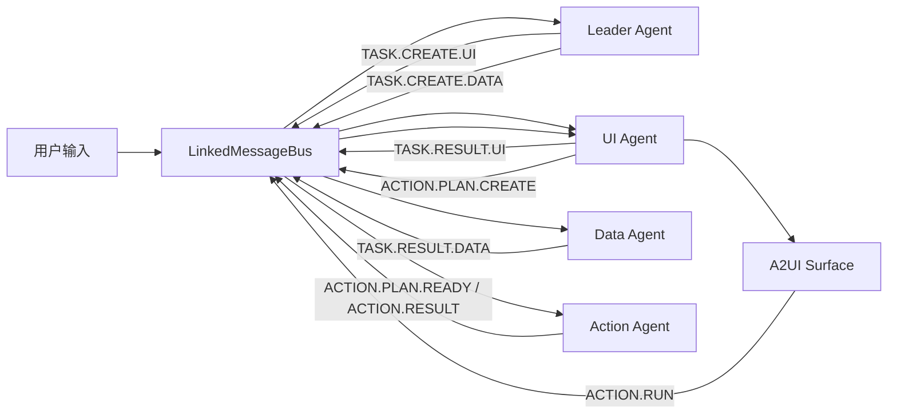

# Appless 多 Agent 后端与酒店场景设计

**日期：** 2026-07-20

**状态：** 用户已批准

**首个纵向场景：** 酒店搜索、实时房型、拨号与导航

**参考实现：** [Loopy PR #8](https://github.com/Raym0ndKwan/loopy/pull/8)，已于 2026-07-20 合并，head `a3a874af8e811411a1fe384cf9eb29cef6281326`

## 1. 结论

Appless 的目标运行时拆为四个 Agent：

- **Leader Agent**：理解用户输入，创建本轮任务并通过消息总线派发。
- **Data Agent**：调用已注册的真实 MCP/API/本地 Provider，返回固定外层、领域类型化内层的数据结果。
- **UI Agent**：负责最终 A2UI surface，只能使用组件目录和 ActionCatalog 已允许的 action。
- **Action Agent**：校验并执行已注册 action，支持声明式串行 ActionPlan 以及前序输出绑定；不生成、编译或保存运行时代码。

采用 Loopy PR #8 的直接消息总线方案：四个 Agent 都订阅同一个 Bus，各自过滤消息并维护上下文。Bus 不增加业务编排能力，也不引入额外 Coordinator。

首个纵向场景不是虚构的“酒店预订”，而是当前真实 Provider 能力覆盖的：

- RollingGo 酒店搜索；
- RollingGo 酒店详情、实时房型与报价；
- 有真实坐标时打开 Petal Maps；
- 有唯一匹配的真实电话号码时打开系统拨号盘；
- 不创建、确认或跟踪酒店订单。

## 2. Loopy PR #8 的复用与补足

PR #8 提供以下可直接复用的方向：

- `LinkedMessageBus` 广播消息；
- `MessageDrivenAgent` 订阅和处理消息；
- Leader 与 UIMaker 的角色拆分；
- 按 Agent 隔离的 ToolRegistry；
- `ChatInteractor` 将用户输入送入 Bus。

PR #8 是两 Agent 原型，消息主体只有 `type` 和 `content`，且 UI 入口只保留单个最近任务。它没有解决本设计需要的：

- 同一会话多轮任务关联；
- UI 与 Data 并行后的结果归属；
- 多个 ActionPlan 同时执行时的步骤关联；
- 迟到结果、超时、取消和局部失败；
- Data Agent 与 Action Agent；
- A2UI action 的双重注册校验；
- workflow 上一步输出传给下一步。

实施时选择性移植 PR #8 的 Bus、Agent 基类和 Leader/UIMaker 结构，不整体覆盖当前 Appless 的 A2UI、Provider、工具注册表或页面入口。

## 3. 目标与非目标

### 3.1 目标

- UI 和数据任务在同一轮内并行启动。
- 数据结果保留真实 Provider ID、来源、账号提示和缺失状态。
- UI Agent 可以先创建骨架，再更新同一个 surface。
- 所有业务按钮必须来自已注册 action。
- Action Agent 可以串行执行多个现有 action，并把前序结构化输出绑定到后续输入。
- 酒店搜索、详情、电话、导航均使用真实数据或显示真实缺失状态。
- 现有 Provider adapter、A2UI v0.9.1 renderer、ToolDefinitionRegistry 和 action policy 继续作为主链路。

### 3.2 非目标

- 不允许 UI Agent 或 Action Agent 生成任意 ArkTS、HTML、JavaScript 或其他运行时代码。
- 第一版 workflow 不支持循环、条件分支、并行分支或任意表达式。
- 不建立第二套 Provider 抽象、第二套工具注册表或通用重试框架。
- 不因 `bookingUrl` 存在就宣称 Appless 可以创建酒店订单。
- 不一次性切换所有现有场景；先以酒店纵向切片验证架构，再迁移邮件等场景。

## 4. 运行时架构



Bus 只广播类型化消息。Agent 不互相持有实例，也不直接调用另一个 Agent。

### 4.1 Leader Agent

- 接收 `INPUT.USER`。
- 复用 `ChatInteractor` / `ConversationStore` 的 `conversationId`，创建 `turnId` 和本轮任务 ID。
- 判断本轮需要哪些能力和输出 schema。
- 并行发布 UI 与 Data 任务。
- 按 `turnId` 维护本轮 UI/Data/Action 的完成、失败或取消状态。
- 不生成 A2UI，不调用 Provider，不决定具体按钮布局。

### 4.2 Data Agent

- 只执行注册的搜索、读取和详情类工具。
- 复用现有 `ToolDefinitionRegistry`、backend resolution 和 Provider adapter。
- 在 Provider 边界完成输入校验和返回值规范化。
- 发布固定 `DataResult`，不直接生成 A2UI。
- 真实数据部分成功时返回 `partial`，不把可用结果一起丢弃。

### 4.3 UI Agent

- 负责用户最终看到的 A2UI v0.9.1 surface。
- 可在数据返回前创建同一 `turnId` 的 loading/skeleton surface。
- 只有 UI Agent 能写入或更新 surface；其他 Agent 只能发布结构化结果。
- 依据 `DataResult + ActionCatalog` 决定展示哪些下一步操作。
- 对简单 action 直接使用注册描述；对组合 action 发布 `ACTION.PLAN.CREATE`，等待 Action Agent 返回已验证计划。
- 未注册 action、缺少必要真实字段的 action 和未知 A2UI 组件都不渲染。

### 4.4 Action Agent

- 解析 `ACTION.PLAN.CREATE` 和 `ACTION.RUN`。
- 使用 ActionCatalog 校验 action ID、输入 schema、风险级别和执行 backend。
- 对读操作发布新的 Data 任务；对系统 intent 使用已注册原生 handler；对外部写操作沿用确认策略。
- 维护 `planId/runId` 和各 `stepId` 的运行状态。
- 串行执行 ActionPlan，支持前序输出绑定；失败、超时或用户取消后立即停止。
- 不生成代码，也不接收可执行脚本。

## 5. 消息契约

所有 Bus 消息使用同一个最小信封：

```ts
interface AgentMessage {
  type: AgentMessageType;
  conversationId: string;
  turnId: string;
  taskId: string;
  payload: AgentMessagePayload;
}
```

字段职责：

- `conversationId`：隔离不同会话。
- `turnId`：关联同一轮并行的 UI、Data 和 Action 结果。
- `taskId`：配对单个任务与结果。
- `planId`、`runId`、`stepId`：仅在 Action 消息的 payload 中出现。

第一版消息类型：

```text
INPUT.USER
TASK.CREATE.UI
TASK.CREATE.DATA
TASK.RESULT.UI
TASK.RESULT.DATA
TASK.ERROR
ACTION.PLAN.CREATE
ACTION.PLAN.READY
ACTION.RUN
ACTION.PROGRESS
ACTION.RESULT
TURN.CANCEL
```

错误作为普通类型化消息广播，不用异常跨 Agent 传播。

## 6. 并发、乱序与上下文

- Leader 同一轮连续发布 `TASK.CREATE.UI` 和 `TASK.CREATE.DATA`，不等待其中一个完成。
- UI Agent 按 `turnId` 保存 `surfaceId`、当前 UI 状态和尚未应用的数据结果。
- Data 先到时，UI Agent 暂存结果；surface 就绪后再更新。
- UI 先到时先展示骨架，Data 到达后更新同一个 `surfaceId`。
- 旧 turn 的结果只能更新自己的 surface，不能覆盖当前 turn。
- Data Agent 负责 Provider 调用超时；Action Agent 负责 workflow step 超时；Leader 负责整轮终态。
- `TURN.CANCEL` 后，无法中断的 Provider 可以完成，但结果不得再写入活动 surface。
- Agent 在任务进入终态后释放临时上下文；对话历史继续使用现有 `ConversationStore`。

不新增消息持久化、分布式锁、跨进程队列或 exactly-once 语义。首版仍是单进程内存 Bus。

## 7. DataResult

Data Agent 统一外层协议，内层继续使用当前工具的领域类型：

```ts
type DataResultStatus = 'success' | 'partial' | 'empty' | 'error';

interface DataSource {
  provider: string;
  backend: ToolBackendType;
  operation: string;
  fetchedAt: string;
  accountHint?: string;
}

interface DataResult {
  toolId: string;
  outputSchema: string;
  status: DataResultStatus;
  sources: DataSource[];
  data: Object;
  warnings: string[];
  error?: {
    code: string;
    message: string;
    retryable: boolean;
  };
}
```

`data` 必须与工具注册的 `outputSchema` 对应。例如：

- `hotel.search` → 当前 `HotelSearchResult`
- `hotel.detail` → 当前 `HotelDetailResult`
- `gmail.mail.search` → 当前 Gmail 领域结果

不使用 `A2uiGenericToolResultData` 作为 Agent 间的规范数据模型，因为它会把 provider ID 和领域字段压扁成用于展示的 label/value 行。

## 8. ActionCatalog

不创建独立的第二套注册中心。ActionCatalog 是以下现有能力的只读组合视图：

- `ToolDefinitionRegistry` 中的工具定义；
- 每个产生结果的工具在 `actions` 中声明的后续 action；
- 当前 client action policy 中的纯页面动作；
- workflow 的一个固定入口 `workflow.run`。

UI Agent 渲染 action 前检查一次；Action Agent 执行前再次检查：

1. action ID 已注册；
2. action 属于当前数据工具声明的后续能力；
3. action 与当前 `surfaceId` 中的结构化 action 完全匹配；
4. args 通过目标输入 schema；
5. provider ID、坐标、电话号码和账号身份与当前 `turnId` 的 DataResult 一致；
6. 风险策略允许当前阶段执行。

模型临时发明的 action ID、篡改参数的 UI 事件和跨 turn 重放一律拒绝。

## 9. 串行 ActionPlan 与输出绑定

组合按钮背后是纯数据计划：

```ts
interface ActionInputBinding {
  target: string;
  stepId: string;
  path: string;
}

interface ActionPlanStep {
  stepId: string;
  actionId: string;
  args?: Object;
  inputFrom?: ActionInputBinding[];
}

interface ActionPlan {
  planId: string;
  turnId: string;
  surfaceId: string;
  label: string;
  steps: ActionPlanStep[];
}
```

执行规则：

- 第一版最多 5 个串行步骤。
- `stepId` 唯一；只能引用列表中更早的步骤。
- `path` 只允许标准 JSON Pointer，不能包含表达式或函数。
- Action Agent 在执行前校验所有静态 action 和参数；首个 action 必须是当前 surface 允许的后续能力。
- 每一步完成后，从其结构化结果解析绑定，再校验下一步完整输入。
- 路径不存在、类型不符、步骤失败、步骤超时或用户取消时 fail-fast。
- `confirm_required` 步骤暂停计划并展示确认；确认后从该步骤继续。
- 已完成步骤不会自动回滚；第一版不提供补偿事务。
- `ACTION.PROGRESS` 将当前步骤状态更新到同一 surface。

适合输出绑定的现有场景示例是“AI 回复并保存草稿”：

```text
gmail.ai.reply.draft
  -> 返回结构化 to / subject / body / threadId
gmail.draft.create
  -> 通过 inputFrom 接收上述字段并保存草稿
```

该计划只保存草稿，不自动发送邮件。酒店首版保留独立的详情、导航和拨号按钮，不为了展示 workflow 而拼出没有明确用户价值的组合按钮。

## 10. 酒店纵向切片

### 10.1 搜索与详情

沿用当前真实能力：

- `hotel.search` → RollingGo `searchHotels`
- `hotel.detail` → RollingGo `getHotelDetail`

继续保留：

- `hotelId`
- `destinationId`
- 名称、地址、星级、图片和设施
- 真实经纬度
- 搜索参考价格
- 入住/离店、人数、儿童年龄、房间数和币种
- 房型 `ratePlanId`
- 平均价、床型、餐食、是否需二次确认和取消政策
- `bookingUrl` 作为第三方来源事实

`bookingUrl` 不映射成 Appless 的创建订单 action。

### 10.2 联系方式补充

RollingGo 酒店搜索结果没有电话字段。Data Agent 只能从当前已配置的真实地点 Provider 补充电话：

- 使用酒店名称、地址和坐标匹配地点；
- 只有唯一匹配时读取地点详情；
- 保存 Provider 名称和真实 place ID；
- 优先保存国际拨号格式，同时保留展示格式；
- 无结果、匹配不唯一、字段未返回或 Provider 未配置时省略 `contact`；
- 酒店搜索本身成功但电话补充失败时返回 `partial` 和 warning。

```ts
interface HotelContact {
  displayPhone: string;
  dialPhone: string;
  provider: string;
  providerPlaceId: string;
}
```

不得根据酒店名称猜号码，也不得把同名酒店的电话拼到当前 `hotelId`。

### 10.3 按钮出现条件

| Action | 出现条件 | 执行 |
|---|---|---|
| `hotel.detail` | 正整数 `hotelId`，并保留原查询参数 | Action Agent 发布 Data 任务，Data Agent 调 RollingGo |
| `hotel.navigate` | 当前酒店记录有有效经纬度 | 打开 Petal Maps URI |
| `hotel.call` | 当前酒店记录有唯一匹配的 `contact.dialPhone` | 打开系统拨号盘并预填号码 |
| `hotel.search.restore` | 当前详情来自一个仍存在的搜索 surface | UI runtime 恢复页面 |
| `hotel.book` | 不存在 | 不渲染、不执行 |

`hotel.call` 只打开系统拨号盘。用户必须在系统界面再次确认拨出；第三方应用不直接发起电话。

### 10.4 建议工具定义

```text
hotel.detail
  riskLevel=read
  backend=local_adapter

hotel.navigate
  riskLevel=read
  backend=system_intent
  input=hotelId,name,latitude,longitude,address?

hotel.call
  riskLevel=draft
  backend=system_intent
  input=hotelId,name,dialPhone,displayPhone?
```

`hotel.search.actions` 增加 `hotel.navigate` 和 `hotel.call`。缺少对应真实字段时，UI Agent仍必须省略按钮。

## 11. 失败与降级

| 情况 | 用户可见结果 |
|---|---|
| RollingGo 搜索失败 | 真实错误卡，无酒店 action |
| 搜索为空 | 空结果说明，可修改查询 |
| 酒店有结果，电话补充失败 | 正常酒店卡；隐藏拨号；保留 warning |
| 酒店坐标缺失 | 隐藏导航 |
| 地点匹配不唯一 | 隐藏拨号，不猜测 |
| 系统无法打开地图或拨号盘 | `ACTION.RESULT=error`，原 surface 显示失败原因 |
| ActionPlan 绑定字段缺失 | 停止剩余步骤，显示失败 step 和缺失路径 |
| 未注册 action 或参数被篡改 | 拒绝执行并记录安全日志 |
| 用户取消确认步骤 | ActionPlan 终止，不执行后续步骤 |

不把 transport HTTP 200、Provider ACTIVE、A2UI 卡片出现或系统 intent 已打开解释成业务写操作成功。

## 12. 安全边界

- Provider 返回内容永远作为数据，不作为 Agent 指令。
- UI Agent 只能输出当前 A2UI 组件目录。
- workflow 没有脚本、模板表达式、循环或动态 import。
- JSON Pointer 只能读取已完成步骤的结构化结果。
- Action Agent 重新验证当前 surface、turn、真实 ID 和风险策略。
- 邮件发送、支付、删除和其他外部写操作继续使用已有确认门。
- 日志保留 `conversationId/turnId/taskId/planId/stepId/toolId/actionId/status`，不记录 Provider 密钥或完整隐私正文。

## 13. 实施边界

实施优先复用：

- PR #8 的 MessageBus、MessageDrivenAgent、LeaderAgent 和 UIMakerAgent 结构；
- 当前 `ReActAgentRunner`、`ConversationStore` 和 Agent ToolRegistry；
- 当前 `ToolDefinitionRegistry`、backend resolution 和 action policy；
- 当前 `A2uiSurfaceStore`、A2UI v0.9.1 parser 与 renderer；
- 当前 `HotelToolTypes`、`HotelToolA2ui` 和 RollingGo adapter；
- 当前地图 URI helper 与系统 URL/intent 打开能力。

新增代码只覆盖当前缺口：

- 消息关联字段和类型化 payload；
- Data Agent；
- Action Agent；
- 受限 ActionPlan runner；
- 酒店联系信息规范化；
- `hotel.navigate` 与 `hotel.call`；
- 入口接线和最小测试。

不重写现有 Provider 客户端，也不把所有 `Index.ets` action 分支一次性搬空。酒店链路验证通过后，再按场景逐步迁移。

## 14. 迁移顺序

1. 移植并测试带 `conversationId/turnId/taskId` 的消息总线基础。
2. 接入 Leader、UI、Data、Action 四个订阅者。
3. 只让酒店意图走新管线，其他场景保持当前路径。
4. 完成酒店搜索、详情、导航、拨号的真机证据。
5. 用“AI 回复并保存草稿”验证 ActionPlan 输出绑定，但保持不自动发送。
6. 逐个迁移其余场景；只有覆盖率和回归证据满足后才移除旧路由。

不增加长期 feature-flag 框架。迁移期只保留一个明确的场景路由分支，全部迁移完成后删除。

## 15. 测试与验收

### 15.1 纯逻辑测试

- 同一会话连续两个 turn 不串数据。
- 两个会话并行不串 surface。
- Data 先到、UI 后到时仍正确展示。
- 旧 turn 迟到结果不覆盖当前页面。
- 未注册 action 和篡改参数被拒绝。
- ActionPlan 只接受前序 step 的 JSON Pointer。
- 输出绑定成功后再次验证目标输入 schema。
- 缺失路径、错误类型、失败步骤和超时均 fail-fast。
- `confirm_required` 步骤暂停、确认后继续、取消后终止。

### 15.2 项目测试

- 运行 `scripts/run-hvigor-tests-strict.mjs`。
- 读取 `entry/.test/default/intermediates/test/coverage_data/test_result.txt`，不能只看 shell 或 hvigor exit code。
- 报告现有基线失败与新回归。
- 更新静态 Loopy backend 校验，覆盖四个 Agent 和消息关联字段。

### 15.3 真实 Provider

- RollingGo 返回真实酒店 ID、搜索结果和房型。
- 详情请求沿用搜索结果中的真实 `hotelId` 和查询参数。
- 电话只在真实地点 Provider 唯一匹配且返回号码时出现。
- 无电话或无坐标时验证按钮确实消失。
- 不把 `bookingUrl` 当成创建订单成功。

### 15.4 真机

- 酒店 skeleton 与结果更新发生在同一 surface。
- “查看实时房型”展示真实房型与取消政策。
- “一键导航”打开 Petal Maps。
- “拨打酒店电话”打开带真实号码的系统拨号盘，未自动拨出。
- 手机独立运行时使用 `local://aiphone-tools`。
- 验收时 `hdc fport ls` 为空，Mac gateway 只作为开发辅助，不作为产品成功证据。

## 16. 完成标准

设计实现完成必须同时满足：

- 四个 Agent 都通过 Bus 通信，没有 Agent 实例直连。
- 并行 UI/Data 结果用 `turnId/taskId` 正确关联。
- DataResult 保留领域结构和来源。
- UI surface 中不存在未注册 action。
- Action Agent 能执行带输出绑定的串行计划并 fail-fast。
- 酒店详情、导航和拨号使用真实字段；缺失时 truthful degradation。
- 没有酒店创建订单能力或暗示。
- 严格测试、真实 Provider 和真机证据均按 PASS/PARTIAL/BLOCKED 如实报告。
