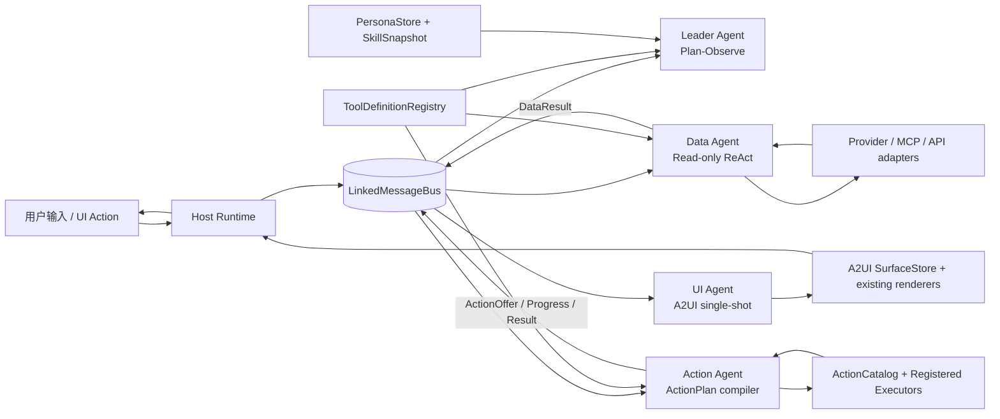
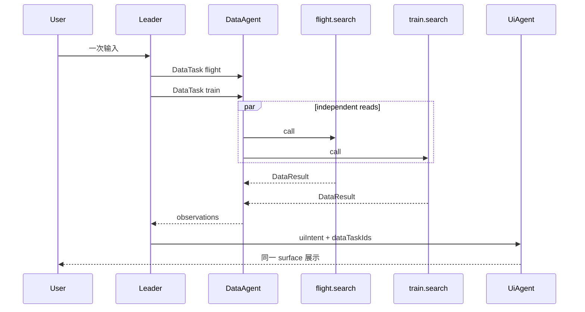

# Appless 全量场景四 Agent 后端迁移设计

Date: 2026-07-21

Status: Approved for planning

Repositories:

- `/Users/luoyige/DevEcoStudioProjects/AIPhoneDemo`
- `/Users/luoyige/DevEcoStudioProjects/loopy`

## 1. 决策摘要

Appless 的全部现有能力将按能力族渐进迁移到统一的四 Agent 后端：

- `LeaderAgent`：理解多轮上下文，选择 persona/skill，规划本轮并行工具与后续观察轮次。
- `DataAgent`：只调用真实的读工具/API/MCP，返回固定 `DataResult`。
- `UiAgent`：使用独立 Prompt 生成受约束的 A2UI `updateComponents` JSONL。
- `ActionAgent`：将用户动作或组合目标编译为已注册 Action/ActionPlan，并交给确定性执行器执行。

四个 Agent 都直接订阅同一个 `LinkedMessageBus`，通过 `conversationId / turnId / taskId` 过滤消息并维护各自上下文；不增加 Coordinator，也不增加第二套工具注册中心。

选择的迁移方案是“按能力族渐进迁移”，不是一次性重写：

1. 先把酒店纵向切片抽象为通用 `MultiAgentRuntime`。
2. 为每个领域接入结构化 DataAdapter、现有 UI renderer 和现有 Action executor。
3. 每个能力族通过契约测试、UI 兼容测试和真机场景后再切流。
4. 迁移期仅允许整轮 `LegacyHandoff`，不能在同一 turn 混用新旧执行链。
5. 全量迁移完成并逐场景验收后，删除旧 `LoopBackend/ReActAgentRunner` 生产兜底。

现有页面布局、按钮位置、查看详情、回复邮件、草稿、确认页、系统跳转等交互原则上保持不变。迁移改变的是后端职责和消息协议，不是首轮重做产品 UI。

## 2. 当前基线与主要问题

### 2.1 当前架构

当前 checkout 已有可工作的结构化四 Agent 酒店纵向切片，并具备以下基础能力：

- 直接广播式 `LinkedMessageBus`；
- Leader/Data/UI/Action 独立订阅；
- `ActionCatalog`、`ActionOffer`、`ActionPlanRunner`；
- 最多五步串行 ActionPlan；
- RFC 6901 JSON Pointer 前序输出绑定；
- UI surface correlation、generation fence、writer lease 和取消；
- `OpenAiA2uiModel`、`A2uiAgentRunner` 和受限 A2UI layout merge；
- 酒店搜索、详情、导航和 App 内 Web 预订真实链路。

但是绝大多数非酒店场景仍从页面进入 `LoopBackend/ReActAgentRunner`。这造成：

- 酒店和其他场景使用两套任务生命周期；
- persona 仍有关键词路由，未由统一 Leader 选择；
- 工具结果有的直接生成 A2UI，有的已经结构化；
- 多工具并行、错误回灌、下一轮规划没有统一责任人；
- UI Agent 在酒店以外尚未成为统一的 A2UI 生成者；
- 新旧 runtime 的超时、终态、取消和 action authority 不一致。

### 2.2 当前能力基线

`ToolDefinitionRegistry` 当前有 46 个固定工具。目标架构仍以它为唯一能力权威，不复制每个 Agent 自己的工具表。

另外有两个运行时虚拟能力：

- `dynamic.search`：发现并执行当前 turn 内的安全只读动态工具；
- `memory.update`：写入明确、稳定、可长期复用的 persona 记忆。

目标迁移不会删减现有真实能力，不会用新 Agent 包一层旧 A2UI JSONL 来伪装迁移完成，也不会把 HTTP 200、预览页或第三方链接误报为写操作成功。

## 3. 目标、非目标与不变量

### 3.1 目标

1. 所有 C01-C20、F01-F16、R01-R04 和能力账本中的 manual-only/excluded 能力都拥有明确的新 runtime owner。
2. 四个 Agent 都有独立 Prompt、输入契约、输出契约和能力边界。
3. 多轮对话、并行工具、依赖工具、错误观察和 UI 更新只有一个确定的控制流程。
4. persona 和 active skill 由 Leader 模型选择，不再依赖领域关键词路由。
5. `ToolDefinitionRegistry` 是工具 schema、risk、backend、auth 和 action 的唯一事实来源。
6. UI Agent 通过 LLM 选择 A2UI 布局，但不能生成业务事实、action ID 或 action 参数。
7. 现有前端交互和真实 provider executor 尽量原样复用。
8. 迁移期可以安全回退整轮旧 runtime；最终生产代码不保留旧 runtime 兜底。
9. Appless 与 Loopy 的共享 `agent_core` 保持路径和内容一致。
10. 每个场景都有自动、真机或明确 manual-only 的验收证据。

### 3.2 非目标

- 不在迁移中同时发明新的跨领域工作流产品。
- 不把每个 renderer、provider adapter 或 client action 都改成 LLM。
- 不增加第五个自由 Agent 或通用 DAG/workflow 引擎。
- 不允许任意脚本、运行时代码生成、循环、分支或无限 ReAct。
- 不在 UI Prompt 中放 provider token、完整原始 payload 或可执行 action args。
- 不改变现有外部写操作的确认、安全测试目标和真实 ID 规则。
- 不以迁移为由自动发送邮件、付款、叫车、下单或修改真实工作资源。

### 3.3 产品不变量

- Provider 数据必须来自真实工具结果；空、失败、超时和未授权必须如实显示。
- 真实 entity ID、thread ID、message ID、place ID、event ID 和 provider identity 必须贯穿 action。
- UI 不能创造工具能力；skill 不能扩大工具权限。
- 写操作在执行前必须重新校验当前 surface、参数、风险和确认状态。
- 一个 turn 一旦开始新 runtime 的 provider/action 执行，就不能再自动重放到 legacy。

## 4. 方案选择

### 4.1 方案 A：按能力族渐进迁移（采用）

- 提取通用 runtime 和消息协议。
- 每个能力族提供结构化 DataAdapter、UI compatibility adapter 和 Action executor mapping。
- 每波验证通过后加入 `MIGRATED_TOOL_IDS`。
- 最终移除 allowlist、LegacyHandoff 和旧生产 runtime。

优点：影响面可控、可以逐场景对比、容易保护真实写操作和现有 UI。缺点：迁移期需要维护明确的新旧边界。

### 4.2 方案 B：一次性切换全部场景（拒绝）

一次性重写所有工具、UI 和 action 会把 provider 差异、页面兼容、外部写安全和上下文问题混在同一个变更中，无法可靠定位回归。

### 4.3 方案 C：新 Agent 内部继续调用旧 ReAct runner（拒绝）

这只会把旧执行器包装成“Data Agent”，无法获得固定 DataResult、统一错误模型、并行控制或真实 ownership，也会长期保留两套 runtime。

## 5. 目标架构



### 5.1 Host Runtime

Host 只负责确定性生命周期，不做语义规划：

- 创建 `conversationId / turnId / taskId`；
- 在发布 `INPUT.USER` 前启动四个订阅者和 turn observer；
- 保存 turn-local data ledger 和 current surface snapshot；
- enforce deadline、cancel、late-message drop 和 writer lease；
- 将最终 `TURN.RESULT` 映射到现有 busy/error/history UI；
- 在迁移期执行整轮 `LegacyHandoff`；
- 不选择 persona、skill、tool、layout 或 action。

### 5.2 一轮标准流程

1. Host 发布带多轮上下文的 `INPUT.USER`。
2. Leader 输出第一轮 `LeaderDecision`。
3. Host/Leader 校验所有 tool IDs 是否已迁移、是否在 registry 中、是否符合 skill 和风险边界。
4. 同一 round 的独立 DataTask 并行发布。
5. Data Agent 为每个 task 执行受限只读 ReAct，并发布 `DataResult`。
6. Leader 读取 bounded observation digest：
   - 足够回答：结束规划；
   - 需要依赖数据：进入下一 planning round；
   - 可修复输入错误：最多修复一次；
   - provider/auth 错误：选择展示 partial/error，而不是换旧 runtime 重放。
7. Action Agent 从真实结果生成不可变 `ActionOffer`。
8. UI Agent 使用独立 Prompt 选择 A2UI 布局，Host 把真实值绑定到允许的数据路径。
9. Host 收到 `TURN.RESULT` 后结束 busy；晚到消息被丢弃。

## 6. 四个 Agent 的职责、Prompt 和输出

四个角色都是真正的 Agent，但不会都使用同一种 ReAct。ReAct 只放在需要观察并再次决策的地方。

### 6.1 Leader Agent

#### 职责

- 理解当前输入和最近多轮上下文；
- 选择 persona 和最多一个 active skill；
- 选择本轮目标工具集合；
- 判断工具是否可并行；
- 读取 DataResult observation，决定回答、澄清、下一轮工具或结束；
- 为 UI 提供语义 `uiIntent`，不生成 A2UI；
- 为组合动作提供 `actionIntent`，不执行工具。

#### 不允许

- 直接调用 provider/API/MCP；
- 生成 action args 或绕过 ActionCatalog；
- 生成 A2UI JSONL；
- 读取 token/credential；
- 超过三轮 Plan-Observe。

#### Prompt 合约

```text
SYSTEM: You are the Appless Leader Agent.
Select one persona and at most one active skill from the supplied catalog.
Plan only with registered capability metadata and the supplied conversation context.
All data tasks in one round must be independent and may run in parallel.
If one task needs another task's real output, wait for observations and create it in the next round.
Never invent IDs, provider facts, action arguments, UI JSON, or tool success.
Return only LeaderDecision JSON matching the schema.
Maximum planning rounds: 3.
```

Leader 看到的是 registry 的 compact metadata：`toolId/domain/intent/risk/inputSchema/outputSchema/backend availability`，不是 executor 或 provider secret。

#### 输出

```text
LeaderDecision {
  personaId
  skillId?
  roundAction: "execute" | "answer" | "clarify" | "legacy_handoff"
  dataTasks: [{ localId, goal, allowedToolIds, input, required }]
  uiIntent: { purpose, preferredDensity, requiredSections }
  actionIntent?: { goal, allowedActionIds }
  answer?: string
  reasonCode
}
```

`dataTasks` 在同一轮内没有依赖边；需要依赖时必须等下一轮。这避免引入通用 DAG 引擎。

### 6.2 Data Agent

#### 职责

- 接收一个 `DataTask`；
- 只在 `allowedToolIds` 中选择真实读工具；
- 根据 provider availability/auth/schema 选择现有 adapter；
- 同一个任务内可进行最多三步 read-only ReAct；
- 对可幂等读请求使用现有 backend fallback；
- 返回统一 `DataResult` 和真实 source/ID/warning/error。

#### 不允许

- 写操作、system intent、Web checkout 或 client action；
- 将旧 A2UI JSONL 填入 `data` 冒充结构化结果；
- 发现动态写工具后直接执行；
- 在任务外追加新目标。

#### Prompt 合约

```text
SYSTEM: You are the Appless Data Agent.
Use only the allowed read-only tool definitions supplied for this DataTask.
You may plan, call, and observe at most 3 read steps.
Preserve provider identity and all real entity IDs.
Do not execute writes, system intents, web sessions, client actions, or generated code.
Do not convert errors or empty results into synthetic success.
Return only DataDecision JSON; the deterministic executor produces DataResult.
```

#### 输出

Data Agent 的模型输出是受限 `DataDecision`；执行后的正式消息仍使用固定结果：

```text
DataResult {
  toolId
  outputSchema
  status: "success" | "partial" | "empty" | "error"
  sources: [{ provider, operation, fetchedAt, receipt? }]
  data
  warnings[]
  error?: { code, message, retryable, authRequired? }
}
```

跨工具错误是否进入下一轮、是否并行调用其他工具，由 Leader 根据 DataResult observation 判断；Data Agent 只处理本任务内部的 adapter 选择、同工具读重试和结果规范化。

### 6.3 UI Agent

#### 职责

- 使用独立 UI Prompt 选择 A2UI component tree、分组、顺序和 action slot；
- 复用 `OpenAiA2uiModel` 和 `A2uiAgentRunner`；
- 只引用明确允许的 `dataPath` 和不可变 `offerId`；
- 输出一条 `updateComponents` JSONL；
- 失败时由现有 renderer 提供确定性兼容布局。

#### 不允许

- 输出 provider facts、原始值、actionId、action args 或任意 HTML/ArkTS；
- 发明组件、data path 或 offer；
- 改写真实值；
- 对 skeleton/error 额外调用模型。

#### Prompt 合约

现有 `OpenAiA2uiModel` 的核心规则保留并推广到全场景：

```text
SYSTEM: You plan one constrained A2UI component layout for a mobile UI renderer.
Output exactly one compact JSON line using updateComponents.
Use only the supplied component catalog, data paths, and offer IDs.
Never output provider facts, action IDs, action args, createSurface, or updateDataModel.
Keep one connected acyclic tree and at most 24 components.
```

温度固定为 `0.2`。UI Agent 是主布局选择者，不再由关键词或硬编码规则选择 UI。现有 scene renderer 永久保留为协议失败和模型不可用时的兼容 fallback，而不是另一个 Agent runtime。

#### 输入与输出

UI 输入只包含：

- `surfaceId`；
- `uiIntent`；
- 可用 component catalog；
- 数据路径、类型、数量和状态摘要；
- immutable `ActionOffer { offerId, label, variant }`；
- 现有交互兼容约束。

模型输出只包含 A2UI `updateComponents`。真实 `updateDataModel` 由确定性 renderer/adapter 产生，action slot 在验证后由 merger 绑定真实 action。

### 6.4 Action Agent

#### 职责

- 把组合动作目标编译为最多五步的 `ActionPlanDraft`；
- 只选择已注册 action；
- 支持后一步用 JSON Pointer 读取前序输出；
- 在每一步绑定完成后再次校验 action schema/risk/backend；
- 高风险步骤暂停等待准确 confirmation；
- 发布 progress/result，并保留 completedStepIds。

精确按钮点击不经过 LLM：按钮已经携带经过 ActionCatalog 校验的 immutable offer，Action Agent 直接按原 action/args 执行，从而保护现有交互和真实 ID。只有“把多个已有 action 串起来”时才调用 Action Prompt。

#### Prompt 合约

```text
SYSTEM: You are the Appless Action Agent planner.
Compile the requested goal only from the supplied registered action definitions and current ActionOffers.
Use at most 5 serial steps.
A binding may reference only an earlier step through RFC 6901 JSON Pointer.
Do not emit code, expressions, loops, branches, parallel steps, new action IDs, or modified offer args.
Return only ActionPlanDraft JSON matching the schema.
```

#### 输出

```text
ActionPlanDraft {
  planId
  label
  steps: [{ stepId, actionId, args, bindings[] }]
}
```

模型只生成 draft。`ActionCatalog`、`ActionPlanRunner`、confirmation gate、idempotency tombstone 和 `RegisteredActionExecutor` 才是执行权威。

## 7. 多轮上下文、persona 与 skill

### 7.1 ConversationContext

Host 为 Leader 构造 bounded `ContextEnvelope`：

```text
ContextEnvelope {
  recentMessages: last 8 user/assistant messages
  previousPersonaId?
  activeSurfaceSummary?: {
    surfaceId, kind, status, entityRefs[], actionOfferIds[]
  }
  recentObservations: bounded result/error digests
  personaCatalog: PersonaPack[]
}
```

完整 DataResult 保留在本地 turn ledger。Leader 只看到必要摘要和真实引用；UI 只看到允许路径；任何 API key、access token、cookie、授权 header 和大段 provider payload 都不进入 Prompt。

### 7.2 “我在北京”→“查询天气”

第一轮用户说“我在北京”时：

- 它保留在最近 conversation history；
- 如果用户明确说“以后都按北京”或“记住我常住北京”，才通过 `memory.update` 写入长期 memory；
- 不把一次性位置自动写成永久 persona 事实。

第二轮用户说“查询天气”时：

- Leader 从最近 8 条消息解析 location=北京；
- 选择合适 persona/skill；
- 创建 `dynamic.search` 天气读取任务；
- 如果本轮又出现冲突位置，则以当前明确输入为准；无法消歧时先澄清。

首版不增加自动长对话摘要器。超过 bounded history 的长期稳定信息应由现有 persona memory 明确记录。

### 7.3 Persona 选择

Persona 没有 UI selector，仍由模型选择，但选择者统一为 Leader：

- Leader 每 turn 读取 PersonaStore 的 compact PersonaPack；
- `previousPersonaId` 只是含糊续问时的 hint，不是强制粘住；
- 用户明确说“用工作分身”等精确 persona 名称/ID 时作为硬约束；
- 删除生产路径中的 `routePersonaForPrompt` 领域关键词路由；
- persona 只影响语气、偏好、skill/tool narrowing，不改变工具授权。

### 7.4 Skill 使用

- 每 turn 最多一个 `status=active` skill；placeholder/disabled skill 不进入候选。
- Leader 读取 skill description、instructions 和声明 tool IDs。
- skill 的 tool list 只能缩小 registry 权限，不能授权新工具。
- 选择结果写入 `LeaderDecision.skillId`，Data/UI/Action 接收已裁剪任务，不独立重选 skill。
- `memory.update` 只用于稳定身份、偏好和长期约束；不用于一次性任务状态。

不增加独立 Persona Agent 或 Memory Agent。

## 8. 多工具与异常回灌

### 8.1 同轮并行

例如“查明天北京到上海的航班和高铁”：



同一 planning round 的 DataTask 必须相互独立，Data Agent 并发执行。任何一个失败不会覆盖另一个成功；UI 以 `partial` 展示成功结果和真实 warning。

### 8.2 依赖式多工具

例如“先从地点搜索拿真实 placeId，再查详情”：

1. Leader round 1 调用 `maps.place.search`。
2. DataResult 返回真实 `placeId`。
3. Leader observation round 2 创建 `maps.place.details`。
4. UI 最终绑定同一个真实 entity。

不允许 Leader 在 round 1 猜 placeId，也不把依赖伪装成同轮并行。

### 8.3 错误处理责任

- Data Agent：同一任务内部的 schema 校验、读 adapter 选择、可幂等读 fallback。
- Leader：跨任务是否继续、修复一次输入、进入下一 round、partial/clarify/final。
- UI Agent：只选择如何诚实展示 success/partial/empty/error。
- Action Agent：只决定 action plan 的校验、暂停、取消和执行终态。

因此工具异常或结果是否进入下一轮模型规划，唯一判断者是 Leader；是否并行则由 Leader 在生成同一 round 的 DataTasks 时决定。

## 9. 工具注册与 Agent 权限

### 9.1 单一注册源

`ToolDefinitionRegistry` 继续定义：

- `toolId / domain / intent`；
- `riskLevel`；
- `backendPriority / authModes`；
- `inputSchema / outputSchema`；
- A2UI component compatibility；
- action relationships。

Prompt 所见工具列表必须从 registry 派生，禁止维护第二份手写 JSON 或 Agent 私有 registry。

| Agent | 可见/可执行能力 |
|---|---|
| Leader | 只读查看全部 capability metadata，用于规划；注册 0 个 executor |
| Data | 执行下列 25 个固定只读工具，加 turn-scoped `dynamic.search` |
| UI | 注册 0 个业务工具；只使用 component catalog、data paths 和 ActionOffer |
| Action | 执行下列 21 个固定 Action 工具，加 `memory.update` |

所谓“给 Agent 注册工具”在这里是从统一 registry 建立受限只读视图或 executor view，不是在四个 Prompt 旁复制四套注册表。

### 9.2 Data Agent 固定工具（25）

```text
travel.search
train.search
flight.search
hotel.search
hotel.detail
food.search
luckin.order.status
social.feed.search
social.community.search
x.post.search
mail.search
mail.thread.read
gmail.mail.search
gmail.thread.read
youtube.video.search
media.video.search
media.aggregate.search
youtube.mine.playlists
youtube.mine.subscriptions
calendar.events.search
maps.place.search
maps.place.details
ride.estimate
ride.app.link
ride.driver.location
```

`ride.app.link` 虽为读/链接解析能力，后续真正打开外部 app 仍由 Action/client boundary 处理。

### 9.3 Action Agent 固定工具（21）

```text
hotel.navigate
hotel.booking.open
luckin.order.preview
luckin.order.create
social.reply.draft
social.post.preview
mail.draft.create
gmail.draft.create
gmail.draft.apply
gmail.open.web
gmail.message.send
worldcup.open
calendar.event.create
calendar.event.update
calendar.event.delete
payment.send
payment.account.setup
maps.route.open
whatsapp.message.send
ride.order.create
ride.order.cancel
```

目标 registry 中固定工具为 46 个，即 25 个 Data 工具加 21 个 Action 工具；`blocked` 固定工具目标为 0。这里的“Action 工具”包含 draft、preview、confirm-required、system intent 和 web session，不表示都可无确认执行。

### 9.4 虚拟工具

#### dynamic.search

- 归 Data Agent；
- 每 turn 动态发现，离开 turn 后失效；
- 只允许 read/search/list/get；
- 保存 provider、qualifiedName、schema、risk 和 receipt；
- 发现到 write/create/update/delete/send 工具时拒绝执行，直到它被提升为固定 ToolDefinition 并配置确认策略；
- 已有固定领域工具时优先固定工具。

#### memory.update

- 归 Action Agent；
- 只接受明确稳定事实；
- 复用现有 PersonaStore 写入边界；
- UI 展示真实写入结果，不与搜索工具同轮混用。

### 9.5 ActionOffer 与 client action

Action Agent/offer resolver 从当前 DataResult 和 registry 生成：

```text
ActionOffer { offerId, actionId, label, variant, args }
```

UI Agent 只能放 `offerId`。真实 `actionId/args` 被确定性 merger 恢复并在点击时再次校验。

纯页面行为（筛选、排序、展开、返回、show more、局部 pin）继续是 renderer-local client action，不进入 LLM 工具集合，也不需要 Action Agent。

## 10. Gmail 发送的兼容设计

`gmail.message.send` 不再是 `blocked`。目标定义为 `confirm_required`，但保留当前邮件交互，不重做邮件页面：

```text
查询邮件 → 查看正文 → 点击回复 → 撰写/AI 回复 → 点击发送
```

迁移方式：

1. 现有 `html_mail_reply_send` 按钮继续携带当前 surface 中的 provider/threadId/messageId/requestKey/to/body。
2. 按钮点击本身就是准确 confirmation，不再额外弹一个确认框。
3. Host 把 exact offer 交给 Action Agent，不让模型重写参数。
4. Action executor 复用现有 `sendConfiguredMailReply`：
   - QQ/IMAP 继续使用现有 reply executor；
   - Gmail 继续使用现有 `gmail.reply.send` provider path。
5. UI 继续消费现有 `MailReplyUiEvent`，保留 loading/success/error 状态。

对于没有选中真实邮件/线程、仅凭自然语言要求新发邮件的场景，仍必须先生成可审查内容和真实收件人，不允许模型直接发送。

自动 C06 继续验证查询、正文、回复、AI 回复和真实草稿，不主动向真实联系人发送。另增加安全目标下的 Gmail reply-send 手工/专用回归；因此能力是已迁移的 `confirm_required`，不是 blocked，也不以默认自动发送作为通过条件。

## 11. 消息协议

继续使用现有外层：

```text
AgentMessage {
  type
  conversationId
  turnId
  taskId
  payload
}
```

保留现有消息：

```text
INPUT.USER
TASK.CREATE.UI
TASK.CREATE.DATA
TASK.RESULT.UI
TASK.RESULT.DATA
TASK.ERROR
ACTION.PLAN.REQUEST
ACTION.PLAN.DRAFT
ACTION.OFFERS.READY
ACTION.PLAN.READY
ACTION.RUN
ACTION.PROGRESS
ACTION.RESULT
TURN.CANCEL
```

`ACTION.PLAN.REQUEST` 由 Leader 发布受限 `goal/allowedActionIds`，是 Action Agent Prompt 的输入；`ACTION.PLAN.DRAFT` 只能由 Action Agent 在编译后发布。这样不会让 Leader 越权生成步骤，也不会把“请求”和“草案”复用成同一种 payload。

最小扩展：

### INPUT.USER

```text
{
  text,
  recentMessages,
  previousPersonaId?,
  currentSurfaceSummary?,
  recentObservationDigests?
}
```

### TASK.CREATE.DATA

```text
{
  roundId,
  goal,
  allowedToolIds,
  input,
  expectedOutputSchema,
  required
}
```

### TASK.CREATE.UI

```text
{
  dataTaskIds[],
  uiIntent,
  allowedDataPaths[],
  componentCatalogVersion,
  interactionCompatibilityKey
}
```

酒店现有 singular `dataTaskId` 升级为数组，从而支持同一 surface 的并行结果。

### TURN.RESULT（新增）

```text
{
  status: "success" | "partial" | "empty" | "error" | "canceled",
  surfaceId?,
  roundCount,
  message
}
```

`TURN.RESULT` 是 Host 结束 busy/timeout 的唯一语义终态，避免页面靠猜测某个工具或 UI 日志来 settle。

## 12. UI 兼容策略

### 12.1 保持不变的内容

- 页面壳、历史、输入框、surface 机制；
- 现有卡片字段、图片、列表、展开/返回；
- Gmail 回复和草稿界面；
- Calendar、Payment、Ride、Luckin 的确认/取消交互；
- Hotel 房型、取消规则、导航和 App 内预订；
- provider/auth/no-config/empty/error 的真实状态。

### 12.2 新 UI Agent 的主路径

1. 领域 DataAdapter 产生真实结构化 model 和 canonical data paths。
2. 现有 renderer 产生事实 data model、action compatibility 和 baseline component tree。
3. UI LLM 基于 catalog/path/offer 选择组件布局。
4. merger 校验后替换 `updateComponents`，但保留事实 data model。
5. invalid/timeout/no-model 时原样使用 baseline。

这保证“由大模型选择 UI”，同时不会让大模型创造数据和按钮权限。

### 12.3 兼容验收

每个场景必须做 snapshot/diff 检查：

- 关键字段存在；
- 主按钮和次按钮行为一致；
- action args 与旧路径相同；
- loading/empty/partial/error 可见；
- 页面返回后 surface 不丢失；
- LLM layout 和 deterministic fallback 都能完成核心操作。

## 13. 错误、重试、取消和资源边界

| 状态 | 处理 |
|---|---|
| `PLAN_INVALID` / `TOOL_NOT_ALLOWED` | provider 调用前发布 `TASK.ERROR`；Leader 可澄清或结束 |
| `TOOL_INPUT_INVALID` | Leader 在剩余 round 中最多修复一次；仍失败则终止 |
| `AUTH_REQUIRED` / `NO_CONFIG` | 返回真实 DataResult.error，并显示授权/配置 UI |
| `PROVIDER_TIMEOUT` | 只读请求可使用现有幂等 backend fallback；写操作不自动重试 |
| `EMPTY` | 真实空成功，不改写为 error 或假数据 |
| `PARTIAL` | 保留成功结果、来源和 warning |
| `UI_PROTOCOL_INVALID` | 使用现有 renderer fallback；两者都失败则 error surface |
| `ACTION_PAUSED` | 等待精确 confirmation，不让其他 runId 恢复 |
| `ACTION_CANCELED` | 终态；晚到 executor 结果丢弃 |
| `ACTION_ERROR` | 保留 completedStepIds 和真实错误，不 legacy replay |

限制：

- Leader 最多 3 个 planning rounds；
- 每个 DataTask 最多 3 个 read ReAct steps；
- ActionPlan 最多 5 步；
- UI 每个最终 result 最多 1 次 layout model call；
- terminal/cancel 后丢弃晚到消息；
- writer 在真正提交 surface 前复查 lease；
- 大型 DataResult 在 turn terminal 后释放；
- compact action idempotency identity 保留到 runtime dispose。

## 14. Legacy 迁移与退出

### 14.1 迁移期整轮切换

所有用户输入先进入新 Leader。Leader 产生工具计划后，Host 检查 `MIGRATED_TOOL_IDS`：

- 所有 planned tool 已迁移：整个 turn 使用新 runtime；
- 任意 planned tool 未迁移：在执行 provider/action 前返回 typed `LegacyHandoff`，整个 turn 使用旧 runtime；
- 不允许一个 turn 中一部分新、一部分旧；
- surface 写入 `runtimeOwner`，后续按钮只能回到相同 owner；
- 新 runtime 一旦开始外部调用，就不再 handoff。

### 14.2 最终保留与删除

永久保留：

- 现有 domain adapters/executors；
- scene renderer 作为 A2UI deterministic fallback；
- ToolDefinitionRegistry、ActionCatalog、PersonaStore、Skill files；
- 现有前端 components/client actions。

最终删除：

- 生产 `LoopBackend/ReActAgentRunner` 调用；
- `PersonaRouter/routePersonaForPrompt` 生产路由；
- `MIGRATED_TOOL_IDS` 和 `LegacyHandoff`；
- 重复的 tool/prompt capability lists；
- 仅服务旧 runtime 的事件适配层。

旧 runtime 不是长期灾备。长期 fallback 是同一四 Agent runtime 内的 provider fallback、UI renderer fallback 和真实 error/partial surface。

## 15. 迁移波次

### Wave 0：通用运行时与 canary

范围：

- 从酒店抽取 `MultiAgentRuntime`；
- 完成 ContextEnvelope、多 DataTask、四 Prompt、TURN.RESULT；
- persona/skill Leader 选择；
- 通用 DataAdapter/UiRenderer/ActionExecutor interfaces；
- C01、C11、C20 canary。

通过门槛：酒店现有行为不回退；“我在北京→查询天气”的上下文契约测试通过；旧 UI snapshot 无关键差异。

### Wave 1：非账号只读与展示

范围：

- C02、C03、C04、C07、C08、C10、C13、C14；
- F01-F04、F09、F12-F15。

重点：多源并行、真实 source/ID、dynamic.read 边界、UI layout/fallback 一致。

### Wave 2：账号读取、详情和授权

范围：

- C05；
- C06 的 Gmail 查询和正文；
- C09 feed 读取；
- F10、F11、F16；
- R01、R03、R04 的只读部分。

重点：auth/no-config、真实 thread/item/file IDs、详情依赖 round、provider timeout。

### Wave 3：草稿、预览、确认页和系统/Web intent

范围：

- C06 回复、AI 回复和草稿；
- C09 回复草稿；
- C12、C15-C18、C20 action；
- F05-F08；
- R02 预览和工作/知识 prepare 动作。

重点：保持当前页面交互、ActionOffer 精确参数、按钮点击跳过 LLM、确认不丢失。

### Wave 4：真实写操作与可逆闭环

范围：

- C19 Calendar create/update/delete；
- Gmail 安全测试 thread 的 reply send；
- manual-only/review-required write 能力的授权、确认和 fail-closed；
- Luckin、Ride、Payment 等只在具备安全测试目标和明确授权时执行。

重点：真实 ID、幂等、写后 receipt/status、finally 清理、不得用 preview/HTTP 200 冒充完成。

### Wave 5：全量验收与旧 runtime 删除

- 跑完 Core、Full、review-required 和手工能力账本；
- 逐能力确认新 owner；
- 删除旧 runtime、allowlist 和 legacy imports；
- Appless/Loopy shared core hash parity；
- exact HEAD 真机构建和回归。

## 16. 逐场景验证矩阵

场景 source of truth 继续是 `appless-device-regression` 的 scenario matrix。迁移计划按下表逐项建立新 runtime 证据。

### 16.1 Core C01-C20

| ID | 迁移波次 | 新 runtime 验收重点 |
|---|---:|---|
| C01 问候 | 0 | Leader 直接回答；无 DataTask、无错误工具卡 |
| C02 综合出行 | 1 | `travel.search` 真实来源；既有卡片兼容 |
| C03 咖啡店 | 1 | `food.search` 地址、来源、列表交互 |
| C04 Google 地点 | 1 | 真实 placeId；详情依赖进入下一 planning round |
| C05 聚合邮件 | 2 | `mail.search` 后读取真实正文，不用摘要冒充 |
| C06 Gmail | 2/3/4 | 查询→正文→回复→AI 回复→草稿保持原交互；安全目标下发送由 confirm-required Action 执行 |
| C07 双视频源 | 1 | B站/YouTube 并行或既有 aggregate；缺一源时 partial |
| C08 新闻讨论 | 1 | aggregate source 不伪造；多区 UI 不退化 |
| C09 X/Slack | 2/3 | 真实 feed item 和回复草稿；不默认发送 |
| C10 X 公开 post | 1 | 作者、时间、链接、内容真实 |
| C11 persona memory | 0 | Leader 选 persona/skill；memory 写入后路由变化；finally 恢复 |
| C12 世界杯 | 3 | 专用页 Web/system action、加载和返回 |
| C13 天气 | 1 | `dynamic.search→weather.query` 只读发现；多轮位置上下文 |
| C14 打车估价 | 1/3 | 真实估价；入口/确认保持，不叫车 |
| C15 瑞幸 | 3/4 | preview 保持；create 仅明确授权和安全环境 |
| C16 Maps 路线 | 3 | 真实路线参数；系统入口和返回 |
| C17 Payment | 3/4 | 收款人、金额、provider 确认；不默认支付 |
| C18 WhatsApp | 3/4 | 只使用配置测试号码；缺失为 BLOCKED；不默认发送 |
| C19 Calendar | 4 | 查询→创建→更新→查询→删除→不存在；结束无残留 |
| C20 酒店 | 0/3 | 搜索、房型、取消规则、导航、App 内 RollingGo；不伪造订单成功 |

### 16.2 Full F01-F16

| ID | 迁移波次 | 新 runtime 验收重点 |
|---|---:|---|
| F01 航班 | 1 | 真实 provider 或真实 error |
| F02 高铁 | 1 | 时间条件和真实铁路结果；当前购票 client action 保持兼容 |
| F03 门店菜单 | 1 | 门店和菜单字段完整 |
| F04 价格查询 | 1 | 不误规划 `luckin.order.preview` |
| F05 Google Pay | 3 | funding source 正确；不支付 |
| F06 Stripe 设置 | 3 | 设置入口；不创建账户 |
| F07 Gmail 新草稿 | 3 | 收件人/正文可审查；真实保存；不发送 |
| F08 应用草稿 | 3 | 只对当前真实 draft 执行 |
| F09 YouTube 搜索 | 1 | 视频卡和打开按钮 |
| F10 播放列表 | 2 | 真实账号数据或 auth error |
| F11 订阅 | 2 | 真实账号数据或 auth error |
| F12 地点详情 | 1 | 使用 C04 的真实 placeId，Leader 次轮依赖 |
| F13 GitHub PR | 1 | dynamic discovered read tool 和真实结果 |
| F14 Drive 文件 | 1/2 | 真实 auth/no-result/file ID |
| F15 Docs 文档 | 1/2 | 真实 auth/no-result/document ID |
| F16 Composio 设置 | 2 | connected/unconnected/failure 和授权返回 |

### 16.3 Review-required R01-R04

| ID | 迁移波次 | 新 runtime 验收重点 |
|---|---:|---|
| R01 社区讨论 | 2 | `social.community.search` 只读结果和来源 |
| R02 社交发帖 | 3/4 | 只到 preview；真实发布另需明确批准 |
| R03 知识工作台 | 2/3 | search/read 使用真实 ID；create/append/overwrite/share 只到 prepare |
| R04 工作项 | 2/3/4 | search 只读；create/comment/update 只到 preview，指定安全项目后再确认 |

### 16.4 manual-only 与 excluded

manual-only 不等于“不迁移”。它们也必须接入 ActionAgent、通过 schema/risk/confirmation/fail-closed 测试，只是不在默认自动真机套件中执行真实副作用。

现有 excluded query 继续不自动运行。唯一状态调整是：

- `gmail.message.send` 从 blocked/excluded capability 改为 `confirm_required`；
- “不确认直接发送”这一危险 query 仍然 excluded；
- 当前邮件正文页的显式发送按钮继续可用，并通过安全目标专项验证。

## 17. 测试与验收门槛

### 17.1 协议与单元测试

- 多轮 history、previous persona、surface refs；
- persona 显式选择、含糊续问、skill 最多一个；
- 多 DataTask 并行、乱序、partial、下一 round 依赖；
- wrong conversation/turn/task、cancel、timeout、late message；
- Leader 3 round、Data 3 step、Action 5 step、UI 1 call 限制；
- DataResult schema、provider identity、真实 ID；
- UI 只能用 allowed paths/components/offers；
- Action JSON Pointer、confirmation、idempotency、stop-on-error；
- `TURN.RESULT` 唯一终态。

### 17.2 Registry 与静态验证

- 46 个固定 ToolDefinition 恰好一个 owner；
- 25 Data + 21 Action；
- `dynamic.search` 和 `memory.update` 各一个虚拟 owner；
- target blocked fixed tool count=0；
- prompts 从 registry/skill snapshot 派生；
- 不存在第二套可漂移工具表；
- 生产代码不再调用关键词 PersonaRouter；
- 迁移完成后无旧 runtime imports。

### 17.3 Domain contract

每个 provider adapter 必须返回真实结构化 `DataResult`：

- 不包旧 A2UI JSONL；
- 不丢 provider source/receipt/ID；
- inner provider error 不因 transport HTTP 200 被吞；
- empty、partial、auth、timeout 分开；
- 写操作具有真实 completion evidence 或明确 BLOCKED。

### 17.4 UI compatibility

每个 C/F/R 场景至少覆盖：

- primary LLM A2UI path；
- deterministic fallback path；
- 关键字段/按钮/action args snapshot；
- empty/error/partial；
- 前后 surface 与返回；
- 现有用户操作步数不无故增加。

### 17.5 真机验收

使用 `appless-device-regression`：

- 当前 exact HEAD 的签名 HAP；
- 权威 Hypium `test_result.txt`，不只看 hvigor exit code；
- C01-C20、F01-F16、R01-R04 的逐场景 summary；
- 必要截图、布局树和 PID-filtered HiLog；
- 本地模型/工具链的 `local://aiphone-tools` 证据；
- `hdc fport ls` 必须为空，证明手机独立运行；
- provider/auth/网络/签名/设备锁等外部问题明确标为 BLOCKED；
- 不将 PARTIAL 或 BLOCKED 汇报为 PASS。

## 18. 删除旧 runtime 的硬门槛

只有同时满足以下条件，才可进入 Wave 5 删除：

1. 46 个固定工具和两个虚拟工具都有唯一新 owner。
2. C01-C20、F01-F16 在新 runtime 下 PASS，或有可复现的外部 BLOCKED 证据。
3. R01-R04 完成人工复核并保持既定 read/preview 边界。
4. manual-only 能力通过 schema、confirmation、safe-target、fail-closed 测试。
5. 现有 Gmail 回复发送行为在安全目标下实测，不额外改变 UI。
6. 没有生产 import 指向旧 `LoopBackend/ReActAgentRunner/PersonaRouter`。
7. 不存在 duplicate ToolDefinition/prompt capability lists。
8. LLM A2UI 和 renderer fallback 均通过主要交互链。
9. Appless 与 Loopy 的受控 `agent_core` 文件路径和 SHA-256 内容一致。
10. exact HEAD 真机回归完成，并如实报告 PASS/PARTIAL/BLOCKED。

## 19. 实施约束

- 实施必须拆成按 wave 可独立审查的小计划，先测试后生产代码。
- 每个能力族迁移后删除它对旧 runtime 的真实 caller，而不是只增加新接口。
- 不在迁移 PR 中顺手改视觉设计、增加新 provider 或扩大写权限。
- 不删除、清理或重组用户现有 worktree、分支和本地文件。
- 产品 PR 不包含 raw provider config、签名材料、smoke artifacts 或无关过程文件。
- 共享 core 改动在 Appless 验证后同步 Loopy，并做受控文件 hash parity。

## 20. 最终结果定义

迁移完成不是“四个类存在”或“一个酒店场景通过”，而是：

- 每次用户输入都由统一 Leader 处理多轮上下文、persona、skill 和工具计划；
- 每个真实数据调用都由 Data Agent 以固定结果契约返回；
- 每个主要页面布局都由受约束 UI Agent 选择，现有 renderer 负责事实与可靠 fallback；
- 每个业务动作都来自 immutable offer 或 registered ActionPlan，由 Action Agent 和确定性 executor 执行；
- 多工具并行、依赖、错误回灌和终态都有统一消息语义；
- 现有功能、交互和安全边界没有因后端迁移而缩水；
- 旧生产 runtime 已删除，逐场景证据可以证明新架构独立工作。
