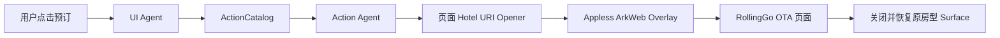

# Appless 酒店 Web 预订设计

日期：2026-07-21
状态：已批准，待实施计划

## 目标

将酒店场景从“搜索、房型、导航、拨号”调整为“搜索、房型、导航、App 内 OTA Web 预订”：

- 删除酒店专用 Google Places 电话补全和 `hotel.call`。
- 使用 RollingGo 返回的真实 `bookingUrl`。
- 在房型页提供一个统一的“在 App 内继续预订”按钮。
- 通过 ArkWeb 在 Appless 内完成 RollingGo 登录、选房和后续预订流程。
- 不伪装成原生订单 API，不推断订单成功，不生成本地订单回执。

## 已验证的能力边界

2026-07-21 使用本机 ignored RollingGo 配置进行了只读 live probe：

- MCP `initialize` 和工具调用返回 HTTP 200。
- `tools/list` 仍只公开 `searchHotels`、`getHotelDetail`、`getHotelSearchTags`。
- 搜索返回真实酒店、价格和 `bookingUrl`。
- 详情返回真实房型、`ratePlanId`、价格、餐食、可售标记和取消政策。
- 搜索和详情中的 `bookingUrl` 相同，均为酒店级链接，不绑定具体 `ratePlanId`。
- 链接为 `https://rollinggo.cn/pages/hotel/detail/index`，携带酒店、入住/离店、成人/儿童和房间参数。
- 浏览器验证确认链接会进入 RollingGo 酒店详情页，展示房型与预订入口；点击价格后进入保留酒店上下文的登录页。
- Provider 没有公开 create、status 或 cancel 工具，因此 App 不能声明原生订单生命周期。

本设计所说的“支持预订”特指：用户在 Appless 内嵌的 RollingGo Web 页面中完成 OTA 流程。它不表示 Appless 通过 MCP 创建、查询或取消订单。

## 用户体验

### 酒店搜索页

每家酒店继续展示：

- 酒店名称、地址、星级、设施、标签和参考价。
- “查看实时房型”。
- 有有效坐标时展示“导航到酒店”。

不再展示：

- “联系酒店”。
- 电话号码。
- Google Places 联系人来源或 place ID。
- `bookingUrl` 原始文本和“离开 Appless”说明；预订入口只通过房型页的受控 Action 展示。

### 房型页

房型页继续展示实时房价计划，但只提供一个统一的预订入口：

- 按钮文案：“在 App 内继续预订”。
- 位置：房型页 hero 信息区，位于日期/住客上下文之后、房型列表之前。
- 说明：“房型与价格由 RollingGo 实时提供，最终房型与价格以预订页为准。”
- `bookingUrl` 缺失或不合法时不展示按钮。

不在每个本地 `ratePlan` 卡片上重复按钮，因为当前 Provider 链接不会锁定该 `ratePlanId`。用户在 RollingGo Web 页面中选择最终房型。

现有“Appless 暂不支持创建或跟踪酒店订单”改为更精确的边界说明：Appless 支持打开 App 内 RollingGo Web 预订，但不提供原生订单创建、状态或取消能力。

### 内嵌预订页

- 顶栏展示“RollingGo 酒店预订”和当前安全域名。
- 提供“返回房型”，关闭 WebView 后恢复原房型 surface。
- 启用 JavaScript、DOM Storage 和站内弹窗。
- 不清理 ArkWeb Cookie/Storage，使用户登录会话可在后续打开时复用。
- 页面加载、登录、房型选择和后续步骤始终保留在 App 内。

关闭 WebView 只表示返回 App，不表示预订成功。

## Agent 架构



### Leader Agent

Leader 仍只负责将用户酒店意图拆成并行 Data/UI 任务。更新 planner 说明：

- 搜索和房型来自 RollingGo 只读工具。
- 没有原生 hotel create/status/cancel。
- Web 预订只能由房型页面上的已注册 Action 启动。

Leader 不根据自然语言直接打开任意 URL。

### Data Agent

Data Agent 继续调用：

- `hotel.search` → RollingGo `searchHotels`。
- `hotel.detail` → RollingGo `getHotelDetail`。

Data Agent 保留 Provider 返回的原始 `bookingUrl`，不自行构造、补全或猜测链接。

删除酒店搜索结果的 Google Places 联系信息补全。Data sources 只报告真正参与结果的数据源；酒店查询不再因为电话补全附加 Google Places source/warning。

### UI Agent

UI Agent 仍只能放置 ActionCatalog 允许的 Action。

`hotel.detail` 成功且 `bookingUrl` 合法时，UI Agent 在第一个房型数据块中携带一次 `hotel.booking.open`。酒店专用 HTML renderer 将该 Action 提升到 hero，保证页面只渲染一个预订按钮。

失败、空结果或 URL 不合法时不放置预订 Action。

### Action Agent

新增已注册 Action：

```json
{
  "id": "hotel.booking.open",
  "args": {
    "hotelId": 558292,
    "bookingUrl": "https://rollinggo.cn/pages/hotel/detail/index?..."
  }
}
```

Action Agent：

1. 使用 ActionCatalog 校验当前 conversation、turn、surface、source tool 和完整参数。
2. 校验 `hotelId` 与 URL 参数一致。
3. 调用页面 Hotel URI opener。
4. 返回 `status=opened` 的结构化 Action Result。

Action Agent 不生成代码，不调用订单 API，不解析 RollingGo 页面，不返回订单号。

## ActionCatalog 与 URL 安全

`hotel.booking.open` 只允许由 `hotel.detail` 放置和执行。

入口 URL 必须满足：

- scheme 为 `https`。
- host 精确为 `rollinggo.cn`。
- path 精确为 `/pages/hotel/detail/index`。
- `id` 为正整数且与 Action `hotelId` 相同。
- `checkInDate`、`checkOutDate`、`roomCount`、`adultCount` 和 `childCount` 存在且格式合法。
- 不允许 URL 用户名或密码。

ActionCatalog 的 surface 参数精确匹配继续提供第二层防篡改保护：即使 HTML 中 Action 被修改，也不能绕过当前 surface 中登记的原始参数。

WebView 首次只接受上述 RollingGo URL。主框架默认只允许 `rollinggo.cn` HTTPS 导航并保持在内嵌 WebView；非 HTTPS scheme 和未批准的跨域主框架跳转均不启动外部 App。静态资源请求不受主框架规则影响。若真实下单流程出现新的第三方支付域名，先通过真机证据确认，再加入最小允许列表，不预先猜测。

## 页面实现

复用现有 Web 能力，不新建第二套浏览器基础设施：

- 将 `PaymentCheckoutOverlay` 收敛为通用 `CheckoutWebOverlay`。
- 内部复用现有 `A2uiWebSurfaceView` 的 URL、加载错误、DOM Storage 和 popup 支持。
- 现有支付场景使用 `kind=payment`，酒店使用 `kind=hotel`。
- 酒店 opener 收到合法 RollingGo URL 时设置页面 overlay 状态，不调用系统浏览器。
- `hotel.navigate` 继续通过 Petal Maps system intent。

这避免 HTML 直接 `window.open` 绕过 Action Agent，也避免复制一份 Hotel WebView。

## 删除范围

删除酒店专用能力：

- `hotel.call` ToolDefinition、Action、参数类型、校验和执行分支。
- `HotelContactLookup.ets`。
- `HotelContact`、电话、Provider 和 Places place ID 字段。
- 酒店结果中直接展示的 `bookingUrl` 文本和“离开 Appless”旧文案。
- `ToolGatewayClient` 酒店联系人 enrichment、并发/超时、测试配置钩子和 warnings/source。
- `MapsApiClient` 中只服务酒店电话补全的字段掩码和函数。
- `HotelSystemIntent` 中拨号 URI。
- Hotel runtime、renderer、smoke、设备脚本和文档中的拨号逻辑。

保留通用能力：

- `hotel.navigate`。
- `maps.place.search` 和其他 Google Maps/Places 场景。
- `GOOGLE_MAPS_API_KEY` 配置，因为非酒店地图功能仍然依赖它。

## 错误处理

- `bookingUrl` 缺失或非法：隐藏按钮，房型结果仍可使用。
- Action 已过期或参数被修改：ActionCatalog 拒绝执行。
- WebView 主页面加载失败：显示真实错误并允许返回房型页。
- 非 HTTPS 或未批准外跳：阻止离开 App，不回退到系统浏览器。
- 用户关闭 WebView：恢复原房型 surface，不生成成功提示。
- Provider 无回调：不推断订单完成，不生成本地订单卡。

## 测试与验收

### 单元与集成测试

- 合法 RollingGo 酒店详情 URL 可生成和验证 `hotel.booking.open`。
- 错误 scheme、host、path、hotel ID 或日期/入住参数被拒绝。
- Action 只能由 `hotel.detail` 放置。
- ActionCatalog 拒绝旧 surface、篡改 args 和未注册 Action。
- 房型页仅渲染一个预订按钮。
- URL 缺失或非法时按钮隐藏。
- 删除 `hotel.call` 后注册表、renderer 和 executor 不再接受拨号。
- Google Places 通用地图测试继续通过。
- RollingGo search/detail 的结构化解析继续保留真实 `bookingUrl`。
- 现有支付 overlay 在通用化后保持原有返回 URL 行为。

### 构建与 Hypium

- 运行模块构建。
- 运行严格测试脚本。
- 直接读取 `entry/.test/default/intermediates/test/coverage_data/test_result.txt`，分别报告 total/passed/failed/error。
- 基线失败与新增回归分开报告。

### 真机回归

使用 `appless-device-regression`：

1. 安装当前分支构建的 HAP。
2. 确认 `hdc fport ls` 为空。
3. 在手机上搜索真实酒店并进入房型页。
4. 验证只出现一个“在 App 内继续预订”。
5. 点击后确认 RollingGo 在 Appless 内加载，并保留酒店、日期、住客和房间数。
6. 验证能进入房型选择和登录页。
7. 关闭后恢复原房型页。
8. 确认没有电话按钮、拨号盘或外部浏览器。
9. 检查 `local://aiphone-tools` 和设备日志。

自动回归不登录、不提交订单、不支付。真实最终订单只在安全测试账号和明确购买授权下验证。

## 仓库一致性

实现完成后：

- Appless 与 Loopy 的 `agent_core` 使用同一份实现。
- 对两边共享树做 SHA-256 文件级比对。
- 不同步 `.env.local`、raw provider config、smoke 产物或设备日志。
- 两边分别提交到独立 `codex/` 分支并更新现有 draft PR，最终保持代码一致。

## 明确不做

- 不新增原生酒店 create/status/cancel ToolDefinition。
- 不把酒店级 URL 描述成精确 `ratePlanId` 预订。
- 不抓取或注入 RollingGo DOM。
- 不保存用户手机号、验证码、密码或支付数据。
- 不在每张房型卡重复同一个预订按钮。
- 不删除与酒店电话无关的通用 Google Places 功能。
